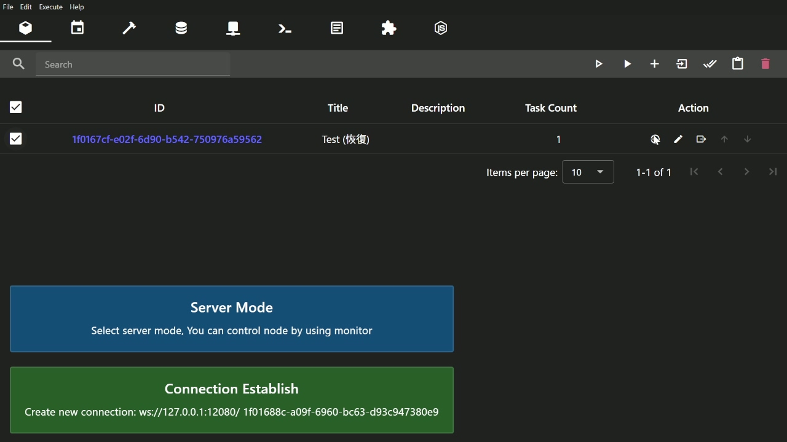
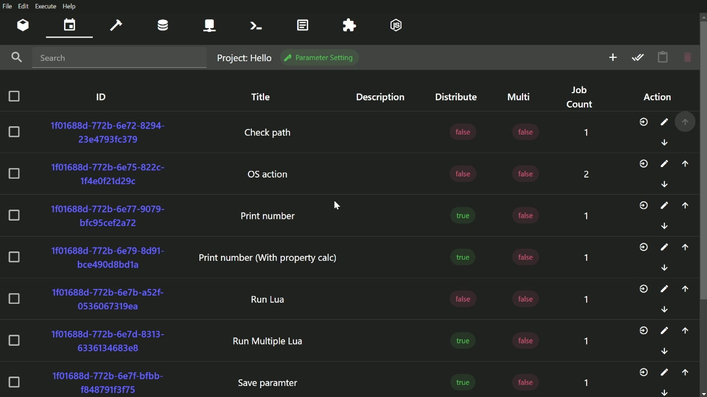
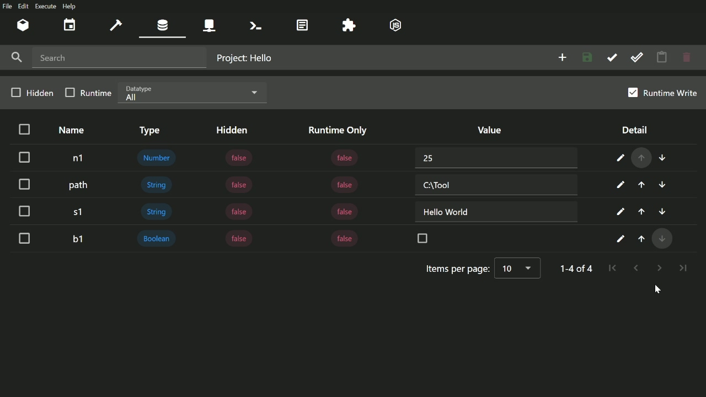
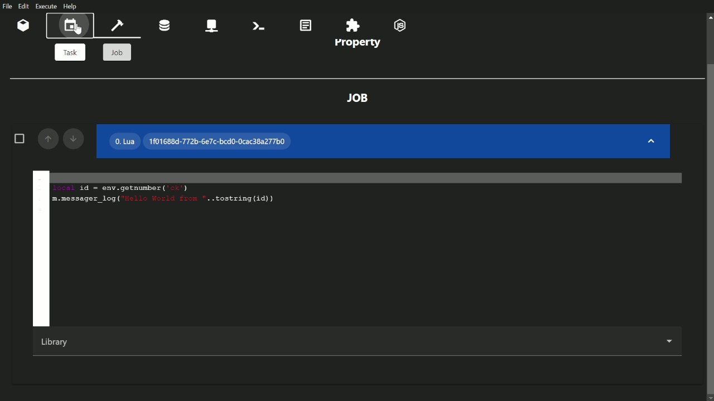
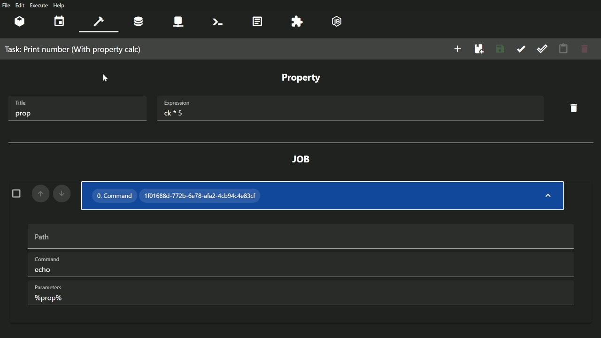
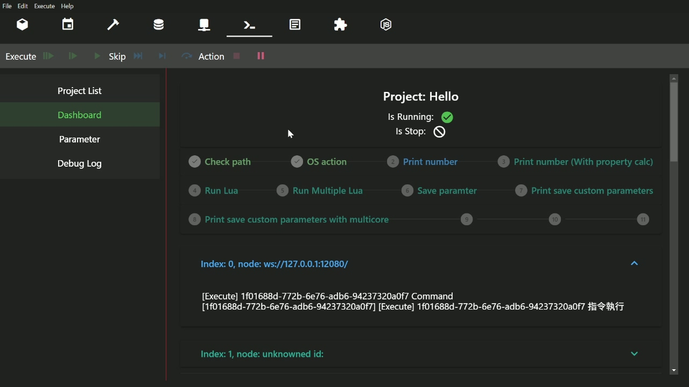

# Verteilen

This is a tool which can manage tasks on multiple computers

[Documentation](https://verteilen.github.io/wiki/) | [Demo](https://verteilen.github.io/.github/) | [Plugin Example](https://github.com/Verteilen/FFmpeg-Plugin) | [Template Example](https://github.com/Verteilen/Template-FFmpeg)

## Screenshot

||||
|-|-|-|
||||
||||

## Features

The checklist features for each type of build

|Features|Desktop|Node|Server|Static Web|
|-|-|-|-|-|
|Task Management|✓||✓|✓|
|Preference|✓||✓|✓|
|Mode Selection|✓||||
|Script|✓|✓|✓||
|Authentication|||✓||
|Plugin|✓||✓||

